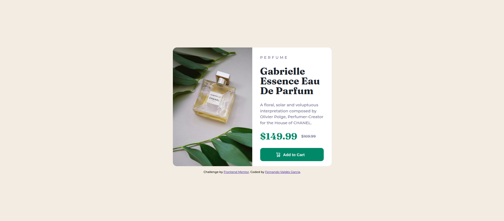

# Frontend Mentor - Product preview card component solution

This is a solution to the [Product preview card component challenge on Frontend Mentor](https://www.frontendmentor.io/challenges/product-preview-card-component-GO7UmttRfa). Frontend Mentor challenges help you improve your coding skills by building realistic projects.  

## Table of contents

- [Overview](#overview)
  - [The challenge](#the-challenge)
  - [Screenshot](#screenshot)
  - [Links](#links)
- [My process](#my-process)
  - [Built with](#built-with)
- [Author](#author)

## Overview

### The challenge

Users should be able to:

- View the optimal layout depending on their device's screen size
- See hover and focus states for interactive elements

### Screenshot

### Links

- Solution URL: <https://www.frontendmentor.io/solutions/responsive-solution-with-flexbox-nGG-HkFF7x>
- Live Site URL: <https://fvaldes0109.github.io/FM-product-preview-card/>

## My process

### Built with

- Semantic HTML5 markup
- CSS custom properties
- Flexbox

## Author

- Frontend Mentor - [@fvaldes0109](https://www.frontendmentor.io/profile/fvaldes0109)
- Twitter - [@CyberNet_inc01](https://www.twitter.com/CyberNet_inc01)
